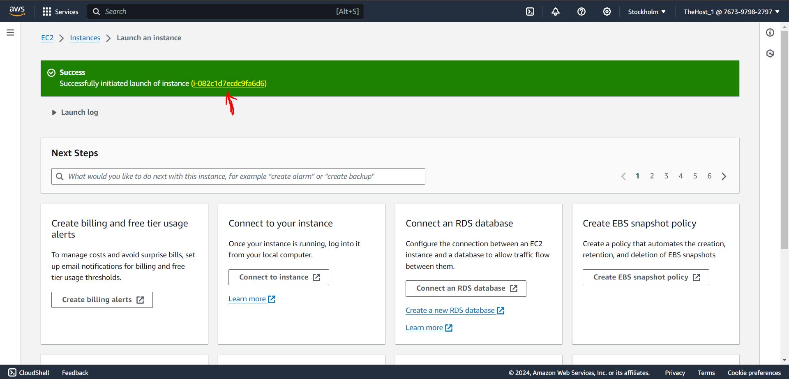
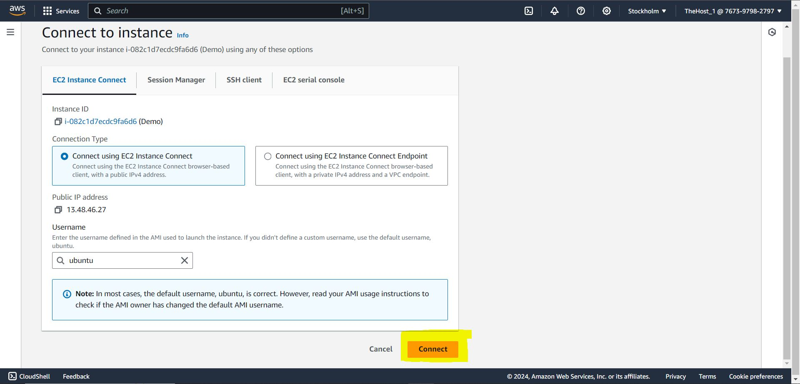

# AWS Deployment Guide
Below are screenshots with **Highlighted** part on what to do


Click on Highlighted **EC2** Instance


Click on **Launch Instance**


Give any name to the instance and select **Ubuntu**


Select **Deep Learning Amazon Machine Image (AMI)** and in instance type select **g2.2xlarge**


In **key pair select demo1** and Click on **Edit in Network Settings**


Now click on **Add Security Group Rule**


**Add Port Range as 8000 and Source as 0.0.0.0/0**


In Configure storage increase apacity from **45 to 60** and click on **Launch Instance**


Click on the **Link** on screen to Launch Instance


Now click on **Check Box** and wait till **Status checks passed** and then select **Connect**


Now click on **Connect**


Your Terminal will now Open and on below left corner you can see your public IP


Now just copy paste below given commands in the terminal

```bash
  nvidia-smi
```
```bash
  git clone https://github.com/SohamNale/aws.git
```
```bash
  cd aws/
```
```bash
  cd chatbot_project/
```
```bash
  pip install -r requirements.txt
```
```bash
  cd –
```
```bash
  python manage.py runserver
```
This command is to run code on local server
```bash
  python manage.py runserver 0.0.0.0:8000
```
This command is to run code on AWS server

**Now just use the publicIP (ex: 13.48.46.27) from aws EC2 instance and add port 8000 to it (ex: 13.48.46.27/8000)**
